# UniCoursePlanner
A web application for planning and managing university courses, modules and events.

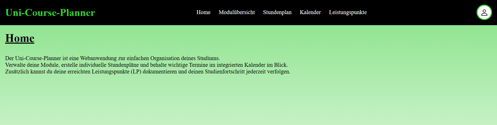

## Motivation
In my Bachelor's thesis, I decided to develop a full-stack web application using Java and Spring Boot. The resulting application, **MyCourse**, was designed to manage extracurricular activities (AGs) and automatically assign students to their selected activities. It was my first project using Java Spring Boot.

After completing my Bachelor's thesis, I wanted to further improve my skills in Java Spring Boot and web development. I therefore revisited the fundamentals of **HTML, CSS and JavaScript** and realized that there was still considerable room for improvement, particularly in creating modern and professional user interfaces.

To improve in this area, I studied different approaches to designing and implementing web interfaces, including **navigation menus and logIn pages**. I used tutorials and examples as a starting point, experimented with the techniques myself and adapted them to my own applications. Through this process, I developed a better understanding of how to create and implement professional-looking interfaces independently.

Testing was another area I wanted to improve. Since automated testing had not been part of my Bachelor's thesis, I specifically learned how to write and apply unit tests for a Spring Boot application.

For this project, I therefore chose technologies that allowed me to build on my existing knowledge while addressing these areas of improvement, including **Thymeleaf, JPA, PostgreSQL, Spring Security and email functionality**, as well as **unit testing**.

I also decided to use **Git and GitHub** throughout the development process in order to gain practical experience with version control and Git-based development workflows.

## Features
### Register
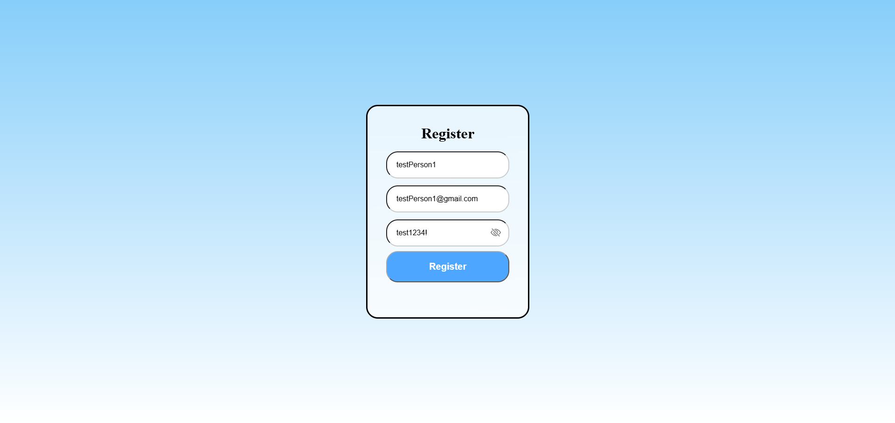
- User registration with password hashing
- Validation to ensure that the username and email are not already in use
- Password visibility toggle

### LogIn
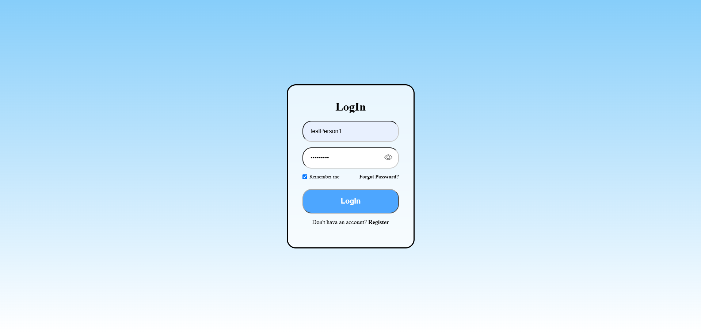
- User authentication using Spring Security
- "Remember me" functionality

### Modules
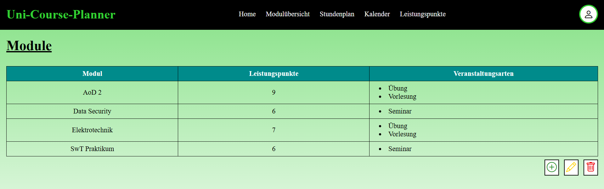
Overview of all modules and their associated events

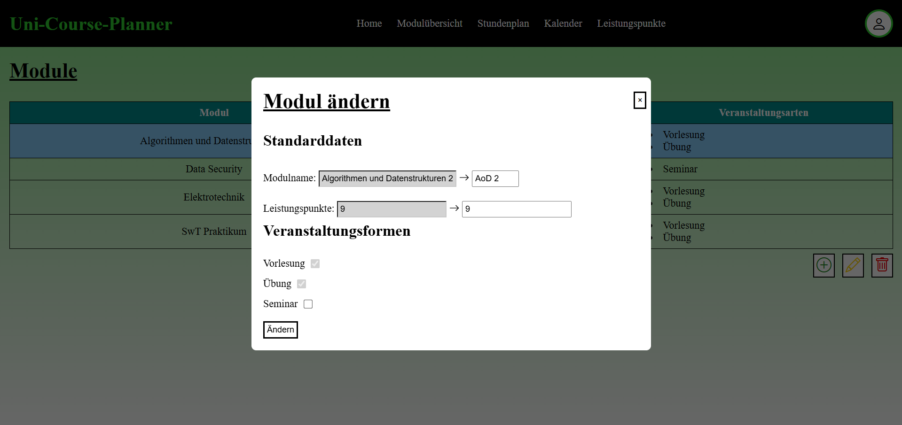
- Modal dialog for editing existing modules
- Edit and delete modules by selecting a table row
- User input validation

### Timetable
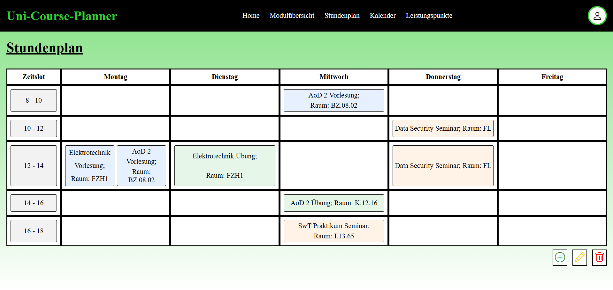
- Weekly timetable using a CSS grid layout
- Multiple lectures can take place at the same time
- Events are visually distinguished by their event type

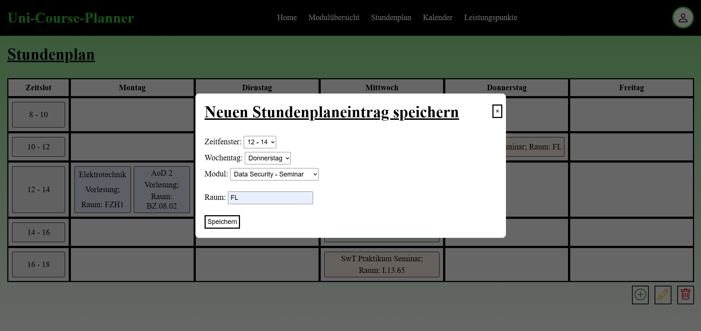
- Modal dialog for adding a new lecture
- Lectures can be edited or deleted by selecting them

### Calendar
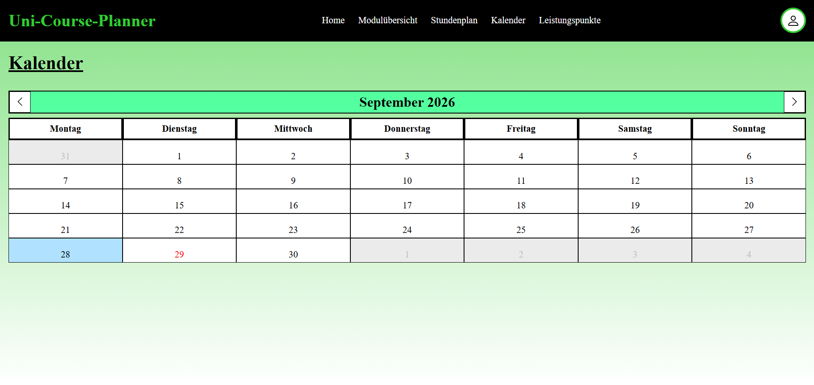
- Monthly calendar using a grid layout
- Navigation between months
- Days containing events are visually marked
- The current day is highlighted

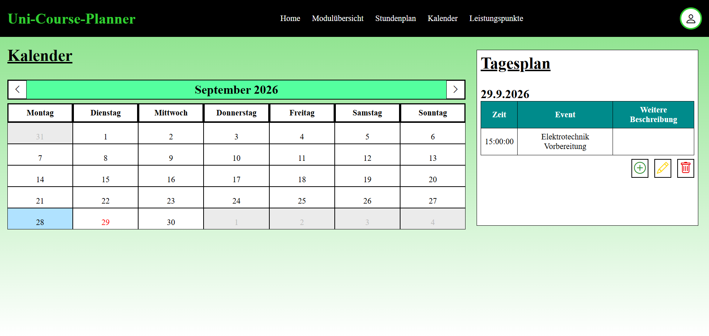
- Selecting a day displays its schedule next to the calendar
- All events of the selected day are displayed in a table

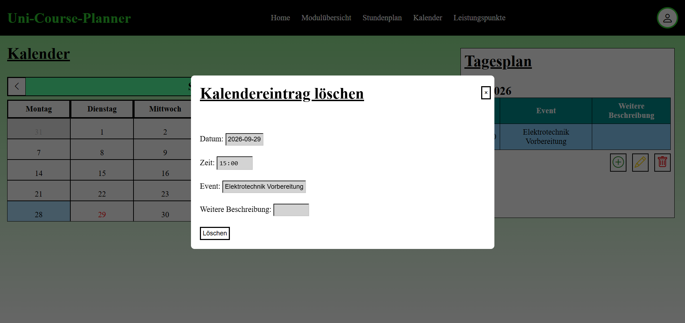
Events can be deleted by selecting them from the day's schedule

### Credits
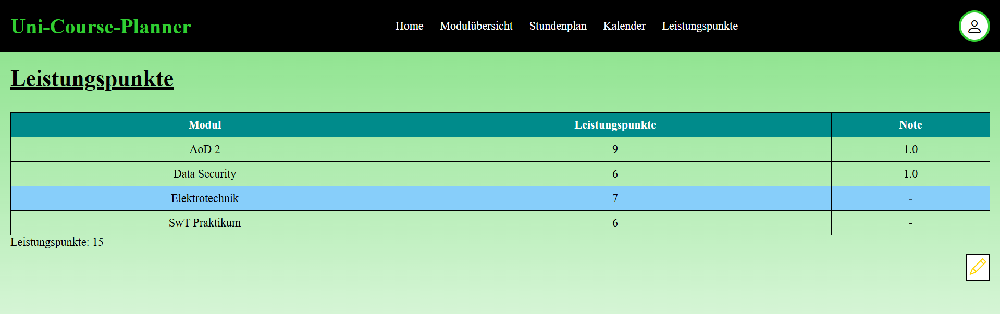
- Overview of credit points and grades for modules
- Grades can be added, edited and deleted
- Credit points of graded modules are automatically summed up

### Profile
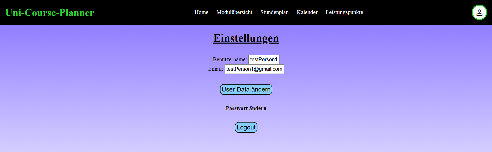
- Users can manage their own profile data
- Username and email can be changed
- Password changes are handled on a separate page

### Forgot Password
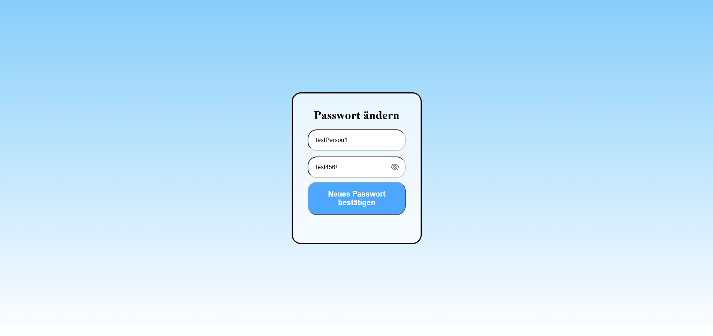
- Users can reset their password using their username or email address
- The username is automatically pre-filled when the password reset is accessed from the profile page
- A verification code is sent via email when a valid username or email address is provided

- Users can enter the verification code received by email
- A correct code allows the user to set a new password
  

Invalid verification codes are rejected and the user can try again

## Technologies
### Backend
- Java
- Spring Boot
- Spring MVC
- Spring Security
- Spring Data JPA
- Hibernate

### Frontend
- Thymeleaf
- HTML
- CSS
- JavaScript

### Database
- PostgreSQL

### Tools
- Eclipse
- Git
- GitHub
- pgAdmin

## Architecture
### Main Structure
The application is structured into several packages according to their responsibilities.

The main packages are:
- **Controller** – handles incoming requests, primarily for displaying and processing pages
- **Service** – contains application and business logic
  - **Email** – handles email sending and contains email templates/content
  - **Security** – handles security-related operations, such as password changes
  - **Modal** – implements the Strategy Pattern for insert, edit and delete operations
  - **Entity** – contains services for entity-specific operations and database queries
  - **Validation** – contains validation rules and corresponding error messages
- **Repository** – handles database access
- **Entity** – represents persistent data
- **DTO** – transfers data between application layers
- **Config** – contains application and security configuration
- **Constants** – contains enums and constants used throughout the application

### Database
The application uses PostgreSQL as its relational database.
JPA and Hibernate are used for object-relational mapping.

`users` (`id [PK]`, `email`)

`log_in_data` (`id [PK, FK]`, `username`, `password`)

`module` (`module_id [PK, FK]`, `user_id [PK, FK]`, `modulename`, `credits`, `grade [NULL]`)

`event_type` (`module_id [PK, FK]`, `user_id [PK, FK]`, `type [PK]`)

`timetable` (`id [PK]`, `day`, `time`, `room`, `module_id [FK]`, `user_id [FK]`, `type [FK]`)

`calendar` (`id [PK]`, `date`, `time`, `topic`, `extension [NULL]`, `user_id [FK]`)

### Example: Calendar Page
The following class diagram shows a selected excerpt of the structure and interactions of the classes and packages involved in the Calendar page.

For readability, only the most relevant packages, classes and relationships are shown. The diagram does not represent the complete class structure of the application.

**UserService** and **User** are shown as attributes rather than as separate classes, as they are only included to illustrate their relevance to the classes shown in the diagram.

### Modal
The following class diagram shows a selected excerpt of the classes and packages directly involved in the modal functionality and the implementation of the Strategy Pattern.

The diagram focuses on the classes directly related to the **ModalServiceFactory**. For readability, only the relevant packages, classes and relationships are shown. Other related packages, such as repositories, entities and validation components, are intentionally omitted.

The **service.entity** package is shown with selected subpackages to indicate that additional entity-related packages exist. The diagram does not represent the complete package structure of the application.

The classes in the **module**, **calendar** and **timetable** packages implement the available **InsertStrategy**, **EditStrategy** and **DeleteStrategy** interfaces. Classes in the **credits** package implement only the **EditStrategy**, while user-specific services do not implement any of the modal strategies.

## Authentication & Security
Authentication and authorization are implemented using Spring Security.

The application provides:
- LogIn and Logout
- User authentication
- Authorization for protected pages
- Password hashing using BCrypt
- Password reset via email verification code
- "Remember me" functionality

## Testing
Testing was one of the main areas I wanted to improve after my Bachelor's thesis.

The project contains unit tests for validation components.

Testing technologies include:
- JUnit
- Mockito

## Version Control
Git and GitHub were used throughout the development process.

The project uses Git for:
- Version control
- Feature branches
- Merging changes

## Future Improvements
Possible future improvements include:
- Integration tests
- Organizing modules into study program folders (e.g. B.A. Mathematics, B.A. Computer Science, M.A. Computer Science)
- Option to transfer timetable events to the calendar
- Export timetable as PDF
